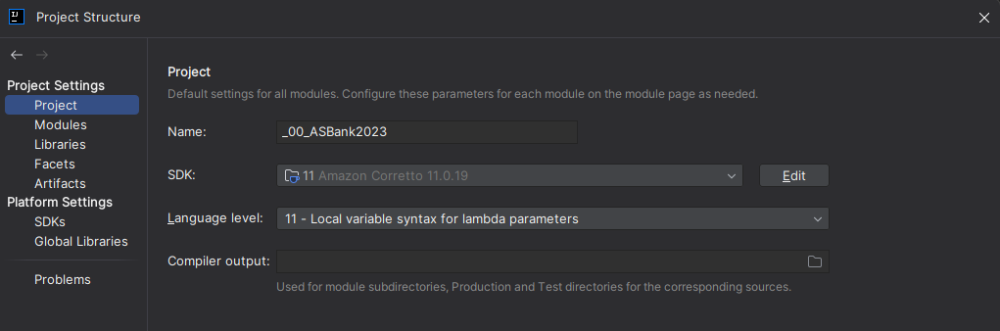
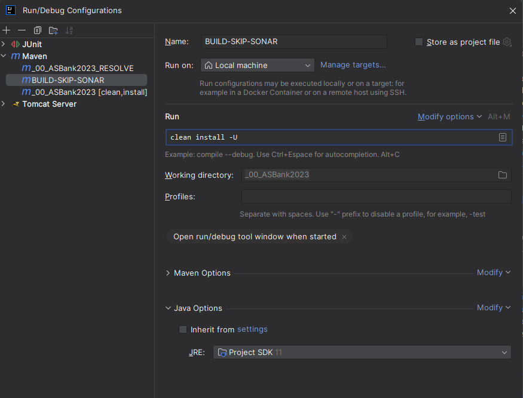
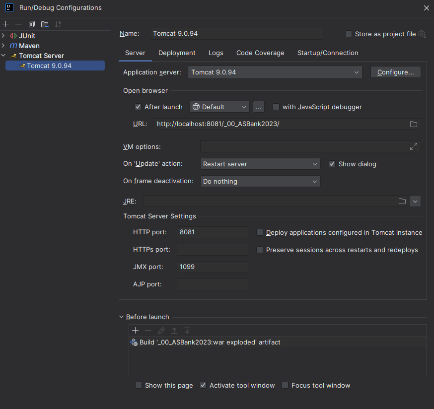
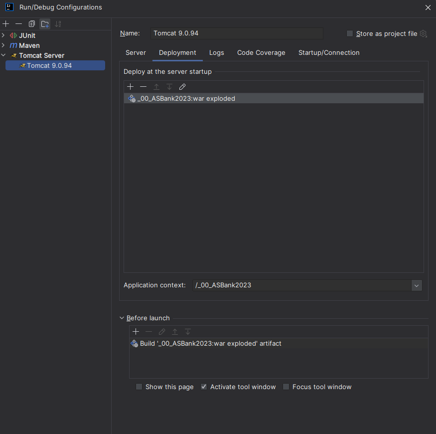

# AS Bank 2023

Ce document décrit les étapes d'installation de l'application AS Bank 2023.  
Ce projet java est basé sur le framework Spring Boot et utilise une base de données MySQL.
En phase de développement, nous utilisons Tomcat comme serveur d'application.
Nous recommandons fortement d'utiliser IDEA IntelliJ comme IDE pour ce projet, notre documentation est basée sur cet
IDE.

## Installation

### Prérequis

- Java 11  
  Ce projet nécessite Java 11 pour fonctionner. Si vous n'avez pas Java 11 installé sur votre machine,
  vous pouvez le télécharger [ici](https://www.oracle.com/java/technolo2gies/javase-jdk11-downloads.html).

- Maven  
  Maven est un outil de gestion de projet Java. Il est utilisé pour automatiser le processus de compilation,
  de test et de déploiement de l'application. Si vous n'avez pas Maven installé sur votre machine,
  vous pouvez le télécharger [ici](https://maven.apache.org/download.cgi).

- MySQL  
  MySQL est un système de gestion de bases de données relationnelles.
  Vous pouvez le télécharger [ici](https://dev.mysql.com/downloads/mysql/).

- Tomcat 9  
  Tomcat est un serveur web Java. Vous pouvez le télécharger [ici](https://tomcat.apache.org/download-90.cgi).

### Configuration du projet

1. Récupérer les fichiers source du projet (fichier ZIP) et décompresser les fichiers dans un répertoire de votre
   choix.  
   Il est fortement déconseillé de déplacer les fichiers après les avoir décompressés, sous peine de rencontrer des
   problèmes de configuration.

2. Ouvrir le projet dans IntelliJ IDEA.  
   Pour ouvrir le projet, ouvrez IntelliJ IDEA, cliquez sur `File` > `Open` et sélectionnez le répertoire du projet.

3. Dans les options de configuration de l'IDE, sélectionnez la version de Java 11 pour le projet.  
   Pour ce faire, cliquez sur `File` > `Project Structure` > `Project` et sélectionnez la version de Java 11 dans le
   champ `Project SDK`.

   

4. Configuration du script maven.  
   Pour configurer le script maven, cliquez sur `Run` > `Edit Configurations` et ajoutez un nouveau script maven en
   cliquant sur le bouton `+` en haut à gauche puis sélectionnez `Maven`.  
    - Assurez-vous que le champ `Run on` est configuré sur `Local machine`.

   Dans la section `Run`
    - Renseignez le champ `Command line` avec `clean install -U`.
    - Assurez-vous que le champ `Working directory` est configuré sur `_00_ASBank2023`.

   
### Tomcat
5. Configuration de Tomcat  
   Pour configurer Tomcat, cliquez sur `Run` > `Edit Configurations` et ajoutez un nouveau serveur Tomcat en cliquant
   sur le bouton `+` en haut à gauche puis sélectionnez `Tomcat Server` > `Local`.  
   Configuration de l'onglet Server :
    - Assurez-vous d'utiliser pour `Application server` votre server TomCat.
    - Pour `HTTP port`, utilisez votre port de choix (`8081` dans l'exemple).
    - Pour `JRE`, utilisez la version par défaut, IntelliJ prendra celui de votre configuration de projet.
    - Pour `Before launch`, ajoutez avec le `+` un `Build Artefacts` et sélectionnez `_00_ASBank2023:war exploded`.
      Si un autre champ que celui-ci est sélectionné, vous pouvez le supprimer en cliquant dessus, puis sur le `-`.

      

   Configuration de l'onglet Deployment :
    - Pour `Deploy at the server startup`, ajoutez avec le `+` un `Artifacts...` et sélectionnez
      `_00_ASBank2023:war exploded`.
      Si un autre champ que celui-ci est sélectionné, vous pouvez le supprimer en cliquant dessus, puis sur le `-`.
    - Remplissez le champ `Application context` avec `/_00_ASBank2023`
      

6. Configuration de la base de données MySQL.  
    - Après avoir ouvert l'indice de commande de votre server MySQL, créer une base de données nommée `bankiut` à l'aide
      de la commande `CREATE DATABASE bankiut;`.
    - Connectez-vous à la base de données `bankiut` avec la commande `USE bankiut;`.
    - Initialisez la base de données en copiant le script `dumpSQL_JUnitTest.sql` situé dans le répertoire `./script`,
      et en le collant dans l'indice de commande de votre serveur MySQL.
    - La connexion à la base de données MySQL est configurée dans le fichier `applicationContext.xml` situé dans le
      répertoire `./WebContent/WEB-INF`. Si vous avez modifié le nom de la base de données ou les informations de
      connexion, veuillez modifier les informations de connexion dans la balise XML d'identifiant `dataSource`.

### Exécution de l'application

1. Compiler le projet.  
   À l'aide du scrip configurer dans l'étape 4, compiler le projet en exécutant le script maven.
   Si vous rencontrez des erreurs liées aux tests unitaires, vous pouvez les ignorer en ajoutant l'option `-DskipTests`
   au script.

2. Démarrez le serveur Tomcat.  
   Pour démarrer le serveur Tomcat, sélectionnez le serveur Tomcat que vous avez configuré dans l'étape 5 et cliquez sur
   l'icône `Run` en haut à droite de l'IDE.

3. Si vous avez effectué toutes les étapes correctement, la page web de l'application devrait s'ouvrir dans votre
   navigateur par défaut.  
   Si ce n'est pas le cas, vous pouvez accéder à l'application en tapant l'URL configuré dans votre Tomcat, soit
   `http://localhost:8081/_00_ASBank2023/` dans notre exemple.

### FAQ

- **Q:** Je ne trouve pas l'artefact `war exploded` dans les options de configuration de Tomcat.  
  **R:** Assurez-vous de ne pas déplacer le répertoire du projet après l'avoir décompressé.

- **Q:** Après avoir compilé mon projet, je rencontre une erreur lorsque je lance mon serveur tomcat: 
         'java.nio.file.InvalidPathException: Illegal char <:> at index 3:'
  **R:** C'est une erreur rare que vous pouvez rencontrer si vous utilisez le JDK11, essayez plutôt le JDK8.
         Téléchargez le [ici](https://www.oracle.com/fr/java/technologies/javase/javase8-archive-downloads.html).
         Changez ensuite le JDK en suivant les étapes décrites [plus haut](#prérequis). Assurez-vous que pour votre `JRE`
         dans votre configuration [tomcat](#tomcat), vous ayez bien laissé le champ en 'Default' (ou vide).