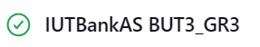

# Installation et configuration de Jenkins

## Installation de Jenkins

Pour installer Jenkins, il faut d'abord télécharger le fichier d'installation. Pour cela, rendez-vous sur le site
officiel de Jenkins à l'adresse suivante : [https://www.jenkins.io/download/](https://www.jenkins.io/download/).

Une fois le fichier téléchargé, lancer l'installation en double-cliquant sur le fichier `jenkins.msi` et suivé les
étapes d'installation.

## Configuration

### Configuration de Jenkins

Après l'installation de Jenkins rendez-vous sur votre navigateur web pour accéder à son interface. Par défaut, Jenkins
est accessible à l'adresse suivante : [http://localhost:8080/](http://localhost:8080/).

Assurez-vous que jenkins utilise la version de Java 8 ou 11. Pour cela, connecter vous en tant qu'administrateur et
allez dans `Dashboard` -> `Manage Jenkins` -> `Tools`, dans la section `JDK installations` ajouter un JDK en cliquant
sur `Add JDK` et sélectionner le JDK installé sur votre machine. Par exemple : 

### Configuration du projet jenkins

Pour configurer un projet Jenkins, il faut d'abord créer un nouveau projet. Pour cela, cliquez sur `New Item` depuis le
dashboard de Jenkins. Ensuite, sélectionnez `Freestyle project`, donnez un nom à votre projet puis cliquez sur `OK`.
Rendez-vous ensuite dans la configuration du projet pour renseigner les éléments suivants :

- **Source Code Management** : Renseignez les informations du dépôt git.
  Renseignez l'URL du dépôt git, les identifiants de connexion si votre dépôt est privé et la branche à builder.

  

- **Build Steps** : Renseignez les commandes à exécuter pour builder votre projet.
  Ajoutez un build step de type `Invoke top-level Maven targets` et dans la section `Goals` renseignez la commandes `clean
install`
  

## Lancement du build

Depuis le dashboard de Jenkins, cliquez sur le projet que vous venez de créer puis cliquez sur `Build Now` pour lancer
le build. Depuis le menu de gauche, vous pouvez accéder à l'historique des builds et consulter les logs de chaque build.
Si votre projet jenkins a bien été configuré et que votre base de données est accessible, vous devriez voir un build
réussi.

- Icon de build réussi dans le menu `Status` :

  
- Logs d'éxécution du build :

```text 
[INFO] ------------------------------------------------------------------------
[INFO] BUILD SUCCESS
[INFO] ------------------------------------------------------------------------
[INFO] Total time:  9.852 s
[INFO] Finished at: 2024-11-02T21:33:27+01:00
[INFO] ------------------------------------------------------------------------
Finished: SUCCESS
```