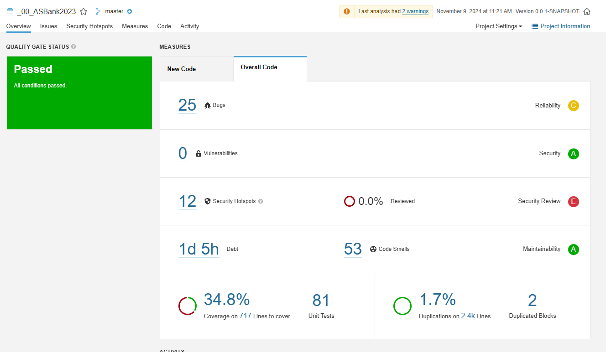
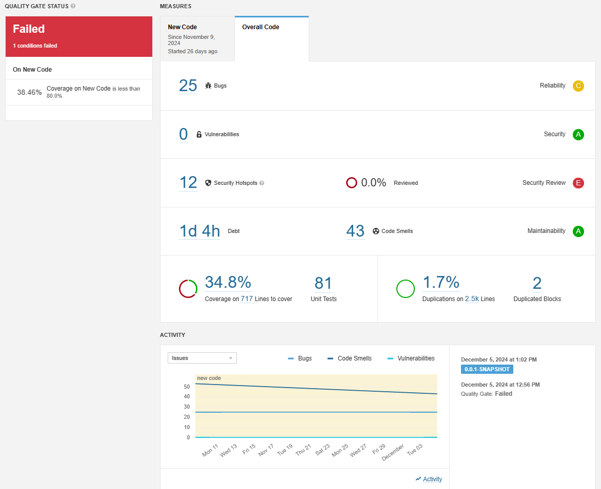
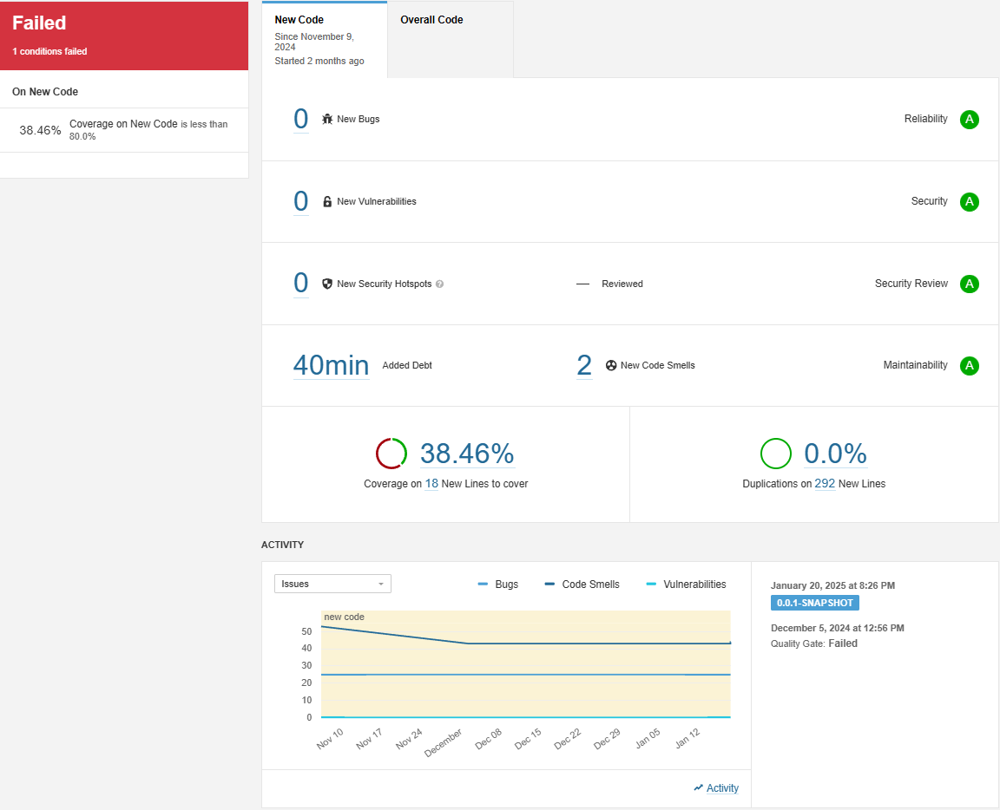
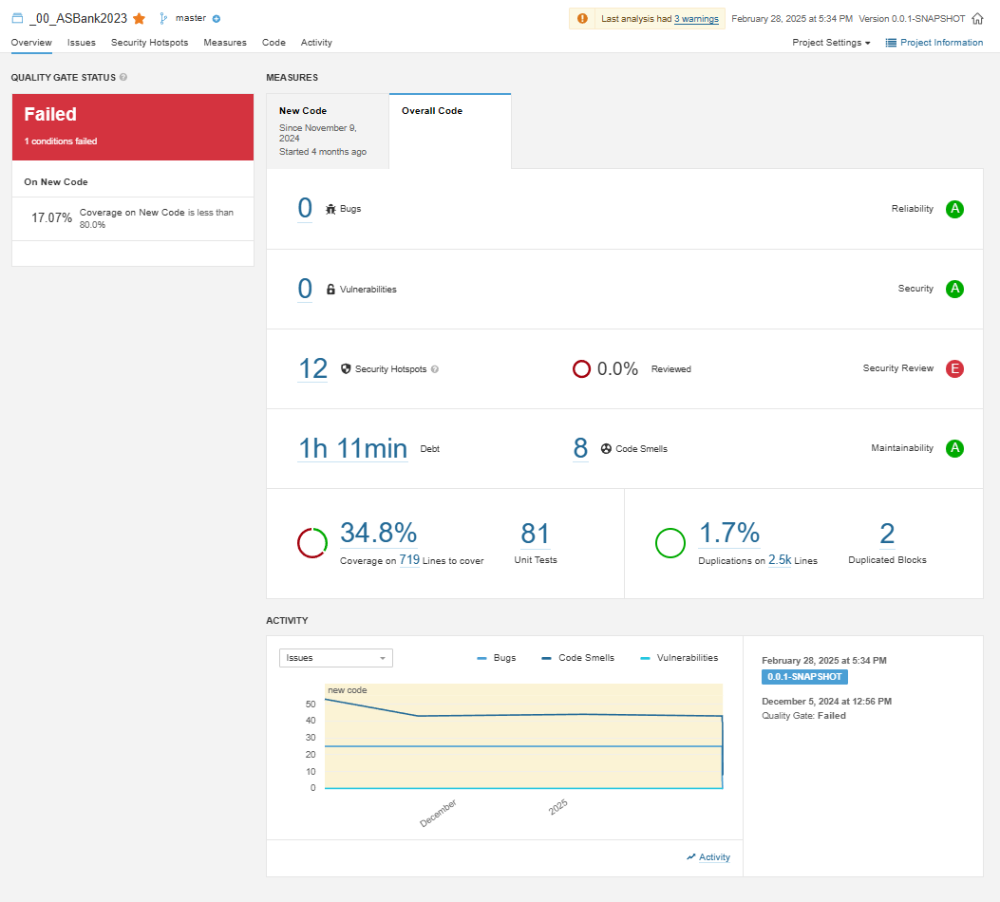
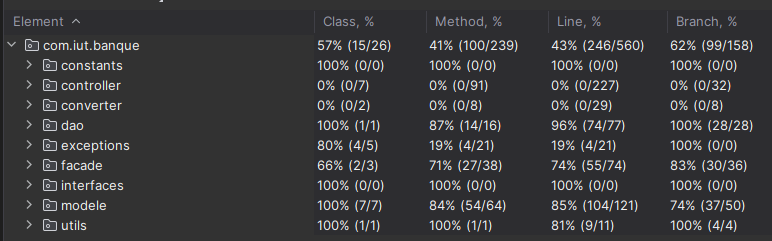
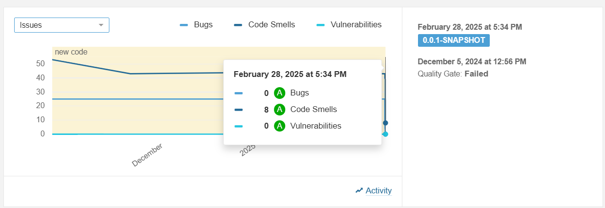

# Utilisation de sonar

Dans cette documentation, nous allons utiliser sonar pour évaluer la qualité de code du projet BankIUT. Ce document
sera divisé en deux sections, la première étant dédié à l'utilisation de SonarLint dans votre IDE, la seconde étant
dédié
à l'installation de SonarQube.

## Installation et utilisation de SonarLint

### Installation de SonarLint

Dans votre IDE installer le plugin SonarLint.


### Utilisation de SonarLint

Faite un clic droit sur votre projet, puis cliquez sur `SonarLint` -> `Analyse with SonarLint`.


Voici le résultat de notre exécution de SonarLint sur le projet BankIUT le 08/11/2024 (Sprint 3).


## Installation et configuration de SonarQube

Malheureusement à l'état actuel de la documentation, nous n'avons pas pu réaliser d'analyse de code avec SonarQube. Nous
allons donc documenter l'état actuel de note avancement dans l'utilisation de SonarQube.

### Installation de Docker

Nous avons utilisé Docker pour installer SonarQube. Pour cela, il vous faudra installer Docker sur votre machine. Pour
cela suivé la documentation officielle de docker pour l'installer sur votre
machine : [https://docs.docker.com/get-docker/](https://docs.docker.com/get-docker/)

### Installation de SonarQube

Pour installer SonarQube, il vous suffit de lancer la commande suivante :

```shell
docker compose --profile sonar up -d --build 
```

Pour toutes les marriage suivant, il vous suffira de lancer la commande suivante :

```shell
docker compose --profile sonar up -d
```

### Configuration de SonarQube

Pour accéder à l'interface de SonarQube, il vous suffit d'ouvrir votre navigateur et de vous rendre à l'adresse
suivante : [http://localhost:9000/](http://localhost:9000/), connectez-vous une première fois avec les identifiants
suivants : `admin` / `admin` puis reconfigurer les identifiants.

Configurer le projet SonarQube en suivant les étapes suivantes :

A VENIR

### Utilisation de SonarQube

Exécuter le scripte `RunSonar.bat` manuellement pour lancer l'analyse de code.

```shell
.\RunSonar.bat
```

Résultat :



## Evaluation de la qualité de code

**09/11/2024**


**23/11/2024**


**20/01/2025**


**28/02/2025**

Pour des raisons qui nous sont inconnues, certain test ne sont pas pris en compte par SonarQube. Voici le taux de
coverage estimer par IntelliJ IDEA :

Également, nous avons grandement réduit le nombre de bug et de code smell dans notre projet. Cela n'est pas facile à
observer sur le screen précédent, en voici un meilleur :
